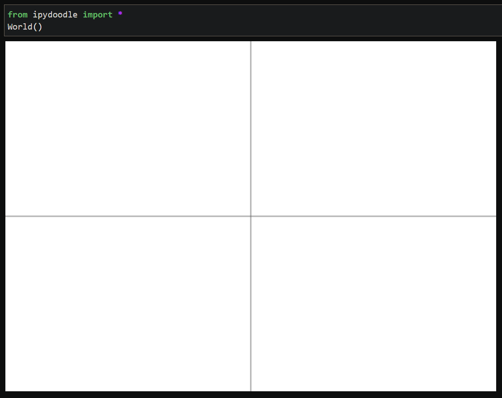

# Language
[Englsh](README.md)

[한국어](README.ko.md)

# ipydoodle


ipydoodle은 학생들을 위한 주피터 환경에서 구동되는 2D 시각화 라이브러리입니다.

# 목표

ipydoodle은 코딩에 익숙하지 않은 학생들을 위해 만들어졌습니다. 따라서 우리의 목표는 그들이 쉽고 즐겁게 코딩을 배우는 것에 있습니다.

## 즉각적인 반응

학생들이 관심을 가지기 위해서는, 아주 단순한 코드라도 실행했을 때 반응이 있어야합니다. 마치 "Hello, World" 처럼요. ipydoodle 에서 "Hello, World"는 다음과 같습니다.



## 물체를 중심으로한 렌더링

ipydoodle에서는 현실과 비슷하게 물체 정의하면 물체에 대해 그림을 그려줍니다. 이런 직관적인 구조는 학생들이 쉽게 라이브러리를 이해할 수 있게 도와줍니다.

예를 들어 다음과 같은 코드는 화면 중앙의 원을 서서히 오른쪽으로 이동시킵니다.
```python
from ipydoodle import *
import time
World()
ball = Circle()
for _ in range(100):
    ball.x += 1
    time.sleep(0.05)
```

# 문서

문서는 [여기](https://github.com/team-monolith-product/ipydoodle/wiki)에서 확인할 수 있습니다.

# 설치

pip를 통해 설치할 수 있습니다.

```
pip install ipydoodle
```

# 예시

## 자유낙하 시뮬레이션

