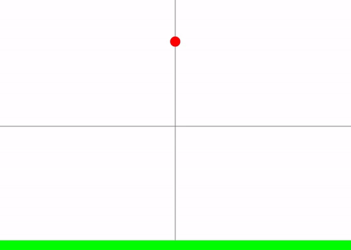

# ipydoodle


ipydoodle은 학생들을 위한 2D 시각화 라이브러리입니다.

ipydoodle에서는 자유롭게 World를 만들고 Object를 만들고 움직일 수 있습니다.

이외에도 학생들이 만들고 싶은 모든 것들을 자유롭게 만들 수 있습니다.

여러분도 ipydoodle과 함께 자신만의 작품을 만들어보세요!!!

<br>

## Documentation(문서)

<br>

ipydoodle과 관련된 문서는 아래의 링크에서 확인할 수 있습니다.

https://github.com/team-monolith-product/ipydoodle/wiki

<br>

## Installation(설치)

<br>

pip를 통해 설치할 수 있습니다.

```
pip install ipydoodle
```

<br>

## Example(예시)

<br>

아래는 ipydoodle로 만든 여러 프로젝트의 예시입니다.

<br>

### 자유낙하 시뮬레이션




